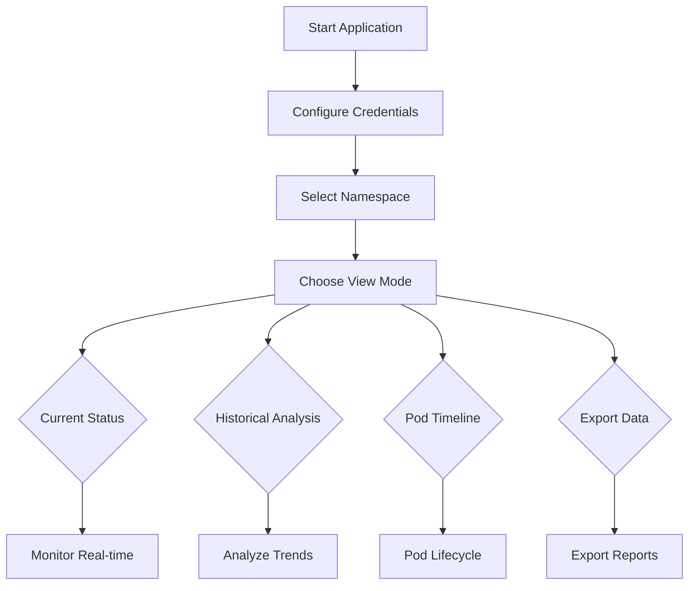

# 🔥 Spark Pod Resource Monitor

A comprehensive Streamlit-based monitoring solution for Apache Spark applications running on OpenShift/Kubernetes. This tool provides real-time resource monitoring with persistent historical data storage, specifically designed to track ephemeral Spark executor pods that terminate quickly.

## 📋 Table of Contents

- [Features](#-features)
- [Architecture](#-architecture)
- [Prerequisites](#-prerequisites)
- [Installation](#-installation)
- [Configuration](#-configuration)
- [Usage](#-usage)
- [View Modes](#-view-modes)
- [Historical Data](#-historical-data)
- [Testing](#-testing)
- [API Reference](#-api-reference)
- [Deployment](#-deployment)
- [Troubleshooting](#-troubleshooting)
- [Contributing](#-contributing)

## ✨ Features

### Real-time Monitoring
- 🔍 **Live Pod Discovery** - Automatically identifies Spark driver and executor pods
- 📊 **Resource Visualization** - Real-time CPU and memory utilization charts
- 🔄 **Auto-refresh** - Configurable refresh intervals (10-300 seconds)
- 🎯 **Application Grouping** - Associates executors with their driver pods

### Historical Analysis
- 💾 **Persistent Storage** - SQLite database for long-term data retention
- 📈 **Timeline Analysis** - Complete pod lifecycle tracking
- 🕒 **Ephemeral Pod Tracking** - Captures terminated executor data
- 📤 **Data Export** - JSON/CSV export capabilities
- 🔧 **Data Retention** - Configurable cleanup policies (1-30 days)

### Advanced Visualizations
- 📊 **Resource Gauges** - CPU/Memory utilization percentages
- 📈 **Trend Charts** - Historical resource usage patterns
- 🔍 **Drill-down Analysis** - From application to individual pod level
- ⚡ **Performance Metrics** - Request vs Limit vs Actual usage

### Code Quality
- 🧪 **Comprehensive Testing** - Unit tests for all modules
- 📦 **Modular Architecture** - Clean separation of concerns
- 🔧 **Real Metrics Collection** - Actual Kubernetes Metrics API integration
- 📚 **Well Documented** - Complete API documentation

## 🏗 Architecture

### Modular Structure
```
src/
├── python/
│   ├── spark_monitor.py          # Main entry point
│   ├── modules/
│   │   ├── __init__.py          # Package initialization
│   │   ├── config.py            # Configuration settings
│   │   ├── database.py          # Database operations
│   │   ├── kubernetes_client.py # Kubernetes API client
│   │   ├── utils.py             # Utility functions
│   │   ├── charts.py            # Chart creation functions
│   │   └── main.py              # Main Streamlit application
│   └── tests/
│       ├── test_utils.py        # Utils unit tests
│       └── test_database.py     # Database unit tests
```

### Data Flow
```
┌─────────────────────┐    ┌─────────────────────┐    ┌─────────────────────┐
│   Streamlit UI      │    │  Kubernetes API     │    │   SQLite Database   │
│                     │    │                     │    │                     │
│ ├── Current Status  │◄──►│ ├── Pod Metrics     │    │ ├── pod_history     │
│ ├── Historical      │    │ ├── Resource Specs  │◄──►│ ├── pod_events      │
│ ├── Timeline        │    │ └── Pod Status      │    │ └── Retention       │
│ └── Export          │    │                     │    │                     │
└─────────────────────┘    └─────────────────────┘    └─────────────────────┘
```

## 📋 Prerequisites

### System Requirements
- Python 3.8+
- OpenShift/Kubernetes cluster access
- Service account with appropriate permissions

### Kubernetes Permissions
```yaml
apiVersion: rbac.authorization.k8s.io/v1
kind: ClusterRole
metadata:
  name: spark-monitor-reader
rules:
- apiGroups: [""]
  resources: ["pods"]
  verbs: ["get", "list", "watch"]
- apiGroups: ["metrics.k8s.io"]
  resources: ["pods"]
  verbs: ["get", "list"]
```

### Python Dependencies
```
streamlit>=1.28.0
plotly>=5.15.0
pandas>=2.0.0
kubernetes>=27.2.0
PyYAML>=6.0
requests>=2.31.0
sqlite3 (built-in)
```

## 🚀 Installation

### Option 1: Local Installation

```bash
# Clone the repository
git clone https://github.com/your-org/spark-pod-monitor.git
cd spark-pod-monitor

# Create virtual environment
python -m venv spark-monitor-env
source spark-monitor-env/bin/activate  # Linux/Mac
# or
spark-monitor-env\Scripts\activate  # Windows

# Install dependencies
pip install -r requirements.txt

# Run the application
streamlit run src/python/spark_monitor.py
```

### Option 2: Docker Installation

```bash
# Build Docker image
docker build -t spark-pod-monitor .

# Run container
docker run -p 8501:8501 \
  -v $(pwd)/data:/app/data \
  spark-pod-monitor
```

### Option 3: OpenShift Deployment

```bash
# Create new project
oc new-project spark-monitoring

# Deploy application
oc apply -f openshift/deployment.yaml
oc apply -f openshift/service.yaml
oc apply -f openshift/route.yaml
```

## ⚙️ Configuration

### Environment Variables

| Variable | Description | Default |
|----------|-------------|---------|
| `DB_PATH` | SQLite database path | `./spark_pods_history.db` |
| `HISTORY_RETENTION_DAYS` | Data retention period | `7` |
| `DEFAULT_NAMESPACE` | Default Kubernetes namespace | `default` |
| `REFRESH_INTERVAL` | Default refresh interval (seconds) | `30` |

### Kubernetes Configuration

#### Service Account Token
1. **OpenShift Login Method:**
   ```bash
   oc login https://your-cluster.com:6443
   oc whoami -t
   ```

2. **Service Account Method:**
   ```bash
   # Create service account
   oc create sa spark-monitor
   
   # Bind cluster role
   oc adm policy add-cluster-role-to-user spark-monitor-reader \
     system:serviceaccount:spark-monitoring:spark-monitor
   
   # Get token
   oc serviceaccounts get-token spark-monitor
   ```

3. **Kubeconfig File:**
   - Upload your kubeconfig file via the UI
   - Or paste token manually in the sidebar

## 🎯 Usage

### Quick Start

```bash
# Clone the repository
git clone https://github.com/your-org/spark-pod-monitor.git
cd spark-pod-monitor

# Use the provided run script (activates venv automatically)
./run.sh

# Or activate manually and run
source spark-monitor-env/bin/activate
streamlit run src/python/spark_monitor.py
```

### Manual Setup

```bash
# Clone the repository
git clone https://github.com/your-org/spark-pod-monitor.git
cd spark-pod-monitor

# Create virtual environment
python -m venv spark-monitor-env
source spark-monitor-env/bin/activate  # Linux/Mac
# or
spark-monitor-env\Scripts\activate  # Windows

# Install dependencies
pip install -r requirements.txt

# Run the application
streamlit run src/python/spark_monitor.py
```

### Basic Workflow



## 📊 View Modes

### 1. Current Status Mode
**Purpose:** Real-time monitoring of active Spark applications

**Features:**
- Live pod discovery and classification
- Resource utilization dashboards
- Driver-executor relationships
- Auto-refresh capabilities

**Use Cases:**
- Production monitoring
- Active job troubleshooting
- Resource optimization

### 2. Historical Analysis Mode
**Purpose:** Trend analysis and performance patterns

**Features:**
- Application-level resource summaries
- Time-based utilization trends
- Pod lifecycle statistics
- Comparative analysis

**Use Cases:**
- Performance tuning
- Capacity planning
- Cost optimization
- SLA monitoring

### 3. Pod Timeline Mode
**Purpose:** Detailed individual pod analysis

**Features:**
- Complete pod lifecycle tracking
- Resource usage timelines
- Event correlation
- Performance statistics

**Use Cases:**
- Debugging failed executors
- Performance investigation
- Resource allocation tuning
- Post-mortem analysis

### 4. Export Data Mode
**Purpose:** Data extraction and backup

**Features:**
- Flexible time range selection
- Multiple export formats (JSON/CSV)
- Application filtering
- Database maintenance tools

**Use Cases:**
- External analysis
- Compliance reporting
- Data archival
- Integration with BI tools

## 💾 Historical Data

### Database Schema

#### pod_history Table
```sql
CREATE TABLE pod_history (
    id INTEGER PRIMARY KEY,
    timestamp DATETIME,
    namespace TEXT,
    pod_name TEXT,
    pod_type TEXT,           -- 'driver' or 'executor'
    app_name TEXT,
    status TEXT,
    cpu_request REAL,
    cpu_limit REAL,
    cpu_usage REAL,
    memory_request REAL,
    memory_limit REAL,
    memory_usage REAL,
    node_name TEXT,
    creation_timestamp DATETIME,
    deletion_timestamp DATETIME,
    is_active BOOLEAN
);
```

#### pod_events Table
```sql
CREATE TABLE pod_events (
    id INTEGER PRIMARY KEY,
    timestamp DATETIME,
    namespace TEXT,
    pod_name TEXT,
    event_type TEXT,         -- 'created', 'running', 'terminated'
    event_reason TEXT,
    event_message TEXT,
    app_name TEXT
);
```

### Data Collection Process

1. **Real-time Collection:** Pods are scanned every refresh interval
2. **Automatic Storage:** All discovered pods stored in database
3. **Lifecycle Tracking:** Pod state changes recorded as events
4. **Cleanup Process:** Old data automatically purged based on retention policy

### Data Retention Policy

- **Default Retention:** 7 days
- **Configurable Range:** 1-30 days
- **Cleanup Schedule:** Daily automatic cleanup
- **Manual Cleanup:** Available via Export Data mode

## 🧪 Testing

### Running Unit Tests

```bash
# Run all tests
cd src/python
python -m unittest discover tests/

# Run specific test modules
python -m unittest tests.test_utils -v
python -m unittest tests.test_database -v
```

### Test Coverage

The test suite covers:
- **Utils Module**: Resource parsing, pod classification, data formatting
- **Database Module**: Data storage, retrieval, cleanup operations
- **Integration Tests**: End-to-end functionality validation

### Test Structure
```
tests/
├── test_utils.py        # Utility function tests
└── test_database.py     # Database operation tests
```

## 🔧 API Reference

### KubernetesClient Class

```python
class KubernetesClient:
    def __init__(self, api_server_url, kubeconfig_token)
    def get_pods(self, namespace) -> List[V1Pod]
    def get_pod_metrics(self, namespace, pod_name) -> Dict
```

### HistoryManager Class

```python
class HistoryManager:
    def __init__(self, db_path=DB_PATH)
    def store_pod_data(self, namespace, pod, pod_type, app_name, resources, metrics)
    def get_historical_data(self, namespace, hours_back=48, app_name=None) -> DataFrame
    def get_pod_timeline(self, namespace, pod_name) -> Tuple[DataFrame, DataFrame]
    def export_historical_data(self, namespace, start_date, end_date, format='json')
    def cleanup_old_data(self, retention_days=HISTORY_RETENTION_DAYS)
```

### Utility Functions

```python
def parse_resource_quantity(quantity_str: str) -> float
def classify_spark_pods(pods: List[V1Pod]) -> Tuple[List[V1Pod], List[V1Pod]]
def get_pod_resources(pod: V1Pod) -> Dict[str, float]
def extract_app_name(pod_name: str) -> str
```

## 🚀 Deployment

### Production Deployment Options

#### 1. OpenShift Deployment

```yaml
# deployment.yaml
apiVersion: apps/v1
kind: Deployment
metadata:
  name: spark-pod-monitor
  namespace: spark-monitoring
spec:
  replicas: 1
  selector:
    matchLabels:
      app: spark-pod-monitor
  template:
    metadata:
      labels:
        app: spark-pod-monitor
    spec:
      serviceAccount: spark-monitor
      containers:
      - name: monitor
        image: your-registry/spark-pod-monitor:latest
        ports:
        - containerPort: 8501
        env:
        - name: DB_PATH
          value: "/data/spark_pods_history.db"
        volumeMounts:
        - name: data
          mountPath: /data
      volumes:
      - name: data
        persistentVolumeClaim:
          claimName: spark-monitor-data
```

#### 2. Docker Compose

```yaml
version: '3.8'
services:
  spark-monitor:
    build: .
    ports:
      - "8501:8501"
    environment:
      - DB_PATH=/data/spark_pods_history.db
      - HISTORY_RETENTION_DAYS=14
    volumes:
      - ./data:/data
      - ./config:/config:ro
    restart: unless-stopped
```

#### 3. Kubernetes with Helm

```bash
# Install via Helm
helm repo add spark-monitor https://charts.example.com/spark-monitor
helm install spark-monitor spark-monitor/spark-pod-monitor \
  --set persistence.enabled=true \
  --set persistence.size=10Gi \
  --set retention.days=14
```

### High Availability Setup

For production environments, consider:

1. **Database:** PostgreSQL instead of SQLite
2. **Load Balancing:** Multiple replicas with shared storage
3. **Monitoring:** Integration with Prometheus/Grafana
4. **Backup:** Regular database backups
5. **Security:** TLS termination and RBAC

## 🔍 Troubleshooting

### Common Issues

#### Connection Problems

**Issue:** "Failed to initialize Kubernetes client"
```bash
# Check cluster connectivity
curl -k https://your-cluster:6443/api/v1

# Verify token validity
oc whoami --show-token
```

**Issue:** "Error fetching pods: Forbidden"
```bash
# Check permissions
oc auth can-i get pods --as=system:serviceaccount:namespace:spark-monitor

# Fix permissions
oc adm policy add-cluster-role-to-user view system:serviceaccount:namespace:spark-monitor
```

#### Database Issues

**Issue:** Database corruption or performance issues
```python
# Database maintenance
import sqlite3
conn = sqlite3.connect('spark_pods_history.db')
conn.execute('VACUUM')  # Optimize database
conn.execute('REINDEX')  # Rebuild indexes
conn.close()
```

**Issue:** Disk space problems
```bash
# Check database size
du -h spark_pods_history.db

# Manual cleanup
sqlite3 spark_pods_history.db "DELETE FROM pod_history WHERE timestamp < datetime('now', '-7 days')"
```

#### Performance Issues

**Issue:** Slow UI response
- Reduce refresh interval
- Limit historical data range
- Enable database indexing
- Consider PostgreSQL for large datasets

### Debug Mode

Enable debug logging:
```python
import logging
logging.basicConfig(level=logging.DEBUG)
```

### Monitoring Health

Check application health:
```bash
# Container health
docker exec -it spark-monitor ps aux

# Database health  
docker exec -it spark-monitor sqlite3 /data/spark_pods_history.db ".schema"

# Log analysis
docker logs spark-monitor | tail -100
```

## 🤝 Contributing

### Development Setup

```bash
# Clone repository
git clone https://github.com/your-org/spark-pod-monitor.git
cd spark-pod-monitor

# Setup development environment
python -m venv venv
source venv/bin/activate
pip install -r requirements-dev.txt

# Run tests
pytest tests/

# Code formatting
black spark_monitor.py
flake8 spark_monitor.py
```

### Contribution Guidelines

1. **Fork** the repository
2. **Create** a feature branch (`git checkout -b feature/amazing-feature`)
3. **Commit** your changes (`git commit -m 'Add amazing feature'`)
4. **Push** to the branch (`git push origin feature/amazing-feature`)
5. **Open** a Pull Request

### Development Roadmap

- [ ] PostgreSQL support for enterprise deployments
- [ ] Prometheus metrics export
- [ ] Advanced alerting capabilities
- [ ] Multi-cluster support
- [ ] REST API for external integrations
- [ ] Advanced resource prediction algorithms
- [ ] Integration with Spark History Server
- [ ] Custom dashboard creation

## 📝 License

This project is licensed under the MIT License - see the [LICENSE](LICENSE) file for details.

## 🙋‍♂️ Support

### Getting Help

- **Documentation:** [Wiki](https://github.com/your-org/spark-pod-monitor/wiki)
- **Issues:** [GitHub Issues](https://github.com/your-org/spark-pod-monitor/issues)
- **Discussions:** [GitHub Discussions](https://github.com/your-org/spark-pod-monitor/discussions)
- **Email:** support@yourcompany.com

### Enterprise Support

For enterprise support, training, and custom development:
- **Commercial Support:** enterprise@yourcompany.com  
- **Professional Services:** Available for custom integrations
- **Training:** On-site training and workshops available

## 🏷️ Version History

### v1.0.0 (Current)
- Initial release with core monitoring features
- SQLite-based historical data storage
- Multi-view dashboard interface
- Export and maintenance capabilities

### Planned Releases
- **v1.1.0:** PostgreSQL support and performance improvements
- **v1.2.0:** Advanced alerting and notification system
- **v2.0.0:** Multi-cluster support and enterprise features

---

**Made with ❤️ for the Spark community**

*This tool is designed to solve the challenge of monitoring ephemeral Spark executor pods in modern data platforms using Apache Iceberg, PySpark, OpenShift, and cloud-native architectures.*