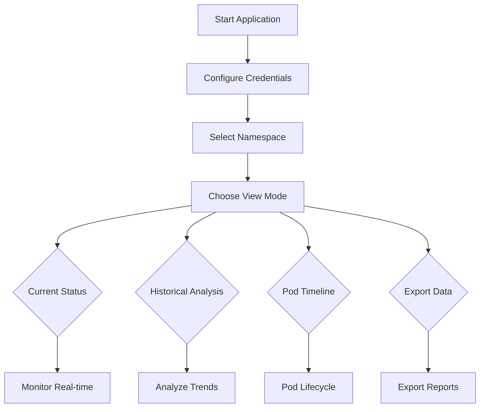

# 🔥 Spark Pod Resource Monitor

A comprehensive Streamlit-based monitoring solution for Apache Spark applications running on OpenShift/Kubernetes. This tool provides real-time resource monitoring with persistent historical data storage, specifically designed to track ephemeral Spark executor pods that terminate quickly.

## 📋 Table of Contents

- [Features](#-features)
- [Architecture](#-architecture)
- [Prerequisites](#-prerequisites)
- [Installation](#-installation)
- [Configuration](#-configuration)
- [Usage](#-usage)
- [View Modes](#-view-modes)
- [Historical Data](#-historical-data)
- [Testing](#-testing)
- [Security](#-security)
- [Troubleshooting](#-troubleshooting)
- [Contributing](#-contributing)

## ✨ Features

### Real-time Monitoring
- 🔍 **Live Pod Discovery** - Automatically identifies Spark driver and executor pods
- 📊 **Resource Visualization** - Real-time CPU and memory utilization charts
- 🔄 **Auto-refresh** - Configurable refresh intervals (10-300 seconds)
- 🎯 **Application Grouping** - Associates executors with their driver pods

### Historical Analysis
- 💾 **Persistent Storage** - SQLite database for long-term data retention
- 📈 **Timeline Analysis** - Complete pod lifecycle tracking
- 🕒 **Ephemeral Pod Tracking** - Captures terminated executor data
- 📤 **Data Export** - JSON/CSV export capabilities
- 🔧 **Data Retention** - Configurable cleanup policies (1-30 days)

### Advanced Visualizations
- 📊 **Resource Gauges** - CPU/Memory utilization percentages
- 📈 **Trend Charts** - Historical resource usage patterns
- 🔍 **Drill-down Analysis** - From application to individual pod level
- ⚡ **Performance Metrics** - Request vs Limit vs Actual usage

### Code Quality
- 🧪 **Comprehensive Testing** - Unit tests for all modules
- 📦 **Modular Architecture** - Clean separation of concerns
- 🔧 **Real Metrics Collection** - Actual Kubernetes Metrics API integration (batched queries)
- 📚 **Well Documented** - Complete API documentation

## 🏗 Architecture

### Modular Structure
```
src/
├── python/
│   ├── spark_monitor.py          # Main entry point
│   ├── modules/
│   │   ├── __init__.py          # Package initialization
│   │   ├── config.py            # Configuration settings
│   │   ├── database.py          # Database operations (WAL enabled)
│   │   ├── kubernetes_client.py # Kubernetes API client (TLS toggle, batch metrics)
│   │   ├── utils.py             # Utility functions (CPU/memory parsers)
│   │   ├── charts.py            # Chart creation functions (MiB units)
│   │   └── main.py              # Main Streamlit application
│   └── tests/
│       ├── test_utils.py        # Utils unit tests
│       └── test_database.py     # Database unit tests
```

### Data Flow
```
┌─────────────────────┐    ┌─────────────────────┐    ┌─────────────────────┐
│   Streamlit UI      │    │  Kubernetes API     │    │   SQLite Database   │
│                     │    │                     │    │                     │
│ ├── Current Status  │◄──►│ ├── Pod Metrics     │    │ ├── pod_history     │
│ ├── Historical      │    │ ├── Resource Specs  │◄──►│ ├── pod_events      │
│ ├── Timeline        │    │ └── Pod Status      │    │ └── Retention       │
│ └── Export          │    │                     │    │                     │
└─────────────────────┘    └─────────────────────┘    └─────────────────────┘
```

## 📋 Prerequisites

### System Requirements
- Python 3.8+
- OpenShift/Kubernetes cluster access
- Service account with appropriate permissions

### Kubernetes Permissions
```yaml
apiVersion: rbac.authorization.k8s.io/v1
kind: ClusterRole
metadata:
  name: spark-monitor-reader
rules:
- apiGroups: [""]
  resources: ["pods"]
  verbs: ["get", "list", "watch"]
- apiGroups: ["metrics.k8s.io"]
  resources: ["pods"]
  verbs: ["get", "list"]
```

### Python Dependencies
```
streamlit>=1.28.0,<1.42.0
plotly>=5.15.0,<6.0.0
pandas>=2.0.0,<3.0.0
kubernetes>=27.2.0,<34.0.0
PyYAML>=6.0,<7.0
requests>=2.31.0,<3.0.0
sqlite3 (built-in)
```

## 🚀 Installation

### Option 1: Local Installation

```bash
# Create virtual environment
python -m venv spark-monitor-env
source spark-monitor-env/bin/activate  # macOS/Linux

# Install dependencies
pip install -r requirements.txt

# Run the application
./run.sh
```

### Option 2: Docker Installation

```bash
# Build Docker image
docker build -t spark-pod-monitor .

# Run container
docker run -p 8501:8501 \
  -v $(pwd)/data:/app/data \
  spark-pod-monitor
```

## ⚙️ Configuration

### Environment Variables

| Variable | Description | Default |
|----------|-------------|---------|
| `DB_PATH` | SQLite database path | `./spark_pods_history.db` |
| `HISTORY_RETENTION_DAYS` | Data retention period | `7` |
| `DEFAULT_NAMESPACE` | Default Kubernetes namespace | `spark-applications` |
| `DEFAULT_REFRESH_INTERVAL` | Default refresh interval (seconds) | `30` |
| `TLS_VERIFY` | Verify TLS certs to API server (`true`/`false`) | `true` |

Notes:
- SQLite is configured for WAL mode and a 5s busy timeout to reduce locking.
- Memory values are displayed in MiB throughout the app.

### Kubernetes Configuration

#### Provide Token Securely
- Prefer storing token in Streamlit secrets. Create a `.streamlit/secrets.toml`:
  ```toml
  KUBE_TOKEN = "<your-token>"
  ```
  Then enable "Use token from secrets" in the sidebar.
- Alternatively, upload a kubeconfig/token file, or paste the token (masked input) in the sidebar.

#### OpenShift Login Method
```bash
oc login https://your-cluster.com:6443
oc whoami -t
```

#### Service Account Method
```bash
oc create sa spark-monitor
oc adm policy add-cluster-role-to-user spark-monitor-reader \
  system:serviceaccount:spark-monitoring:spark-monitor
oc serviceaccounts get-token spark-monitor
```

## 🎯 Usage

### Quick Start

```bash
./run.sh
```

The app opens at http://localhost:8501. Auto-refresh uses Streamlit's built-in autorefresh when available.

### Basic Workflow



## 📊 View Modes

- Current Status: Real-time pods, batched Metrics API calls, driver/executor grouping
- Historical Analysis: Aggregations and trends (memory in MiB)
- Pod Timeline: Per-pod history and events
- Export Data: JSON/CSV export with inclusive end date

## 🧪 Testing

Run tests from the `src/python` directory:

```bash
cd src/python
python -m unittest discover tests -v
```

## 🔐 Security

- TLS verification is enabled by default when connecting to the API server. You can disable by setting `TLS_VERIFY=false` (not recommended).
- Tokens are never written to disk; a temporary kubeconfig is created in-memory and cleaned up immediately.
- Use Streamlit secrets for production deployments.

## 🧰 Troubleshooting

- If Metrics API is unavailable, the app will display zero usage values and a warning banner.
- On SQLite locking errors, ensure a single writer and that the app runs with default WAL mode.