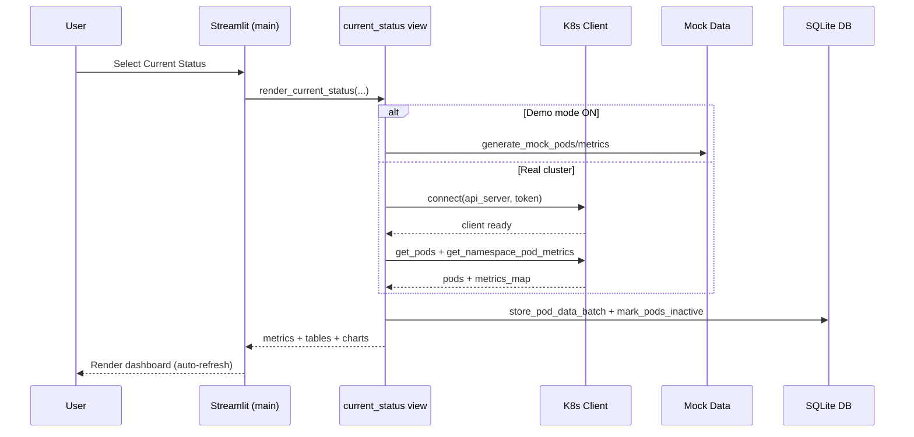

# Developer Guide

This guide explains the architecture, development workflow, testing, and release process for the Spark Pod Resource Monitor.

## Architecture Overview

- Streamlit UI: `src/python/modules/main.py` orchestrates configuration and routes to view renderers.
- Views:
  - Current Status: `src/python/modules/views/current_status.py`
  - Historical Analysis & Timeline: `src/python/modules/views/historical.py`
- Kubernetes client: `src/python/modules/kubernetes_client.py`
- Database (SQLite): `src/python/modules/database.py` (WAL mode, indices)
- Utilities: `src/python/modules/utils.py`
- Charts: `src/python/modules/charts.py`
- Mock data (demo mode): `src/python/modules/mock_data.py`
- Entry point: `src/python/spark_monitor.py`

## Local Setup

1. Create and activate venv
   - python -m venv spark-monitor-env
   - source spark-monitor-env/bin/activate
2. Install deps
   - pip install -r requirements.txt
3. Run
   - ./run.sh

## Configuration & Secrets

- Environment variables: see README (DB_PATH, TLS_VERIFY, etc.)
- Token handling:
  - Preferred: set streamlit secrets in `.streamlit/secrets.toml` with `KUBE_TOKEN`.
  - Sidebar supports file upload or masked paste.

## Demo Mode (Mock Data)

- Use the sidebar toggle “Use mock data (demo)” to render a realistic set of Spark drivers/executors.
- Use “Seed demo data now” to write a snapshot into SQLite for Historical and Timeline views.
- Mock generators:
  - `generate_mock_pods(namespace, drivers=2, executors_per_driver=3)`
  - `generate_mock_metrics(pods)`

## Code Style

- Keep view logic inside `modules/views/*`.
- Main module should handle only configuration, session_state, and routing.
- Prefer context managers for DB interactions.
- Avoid wildcard imports; use explicit imports.

## Testing

- Run all tests:
  - cd src/python
  - PYTHONPATH=./ python -m unittest discover tests -v
- Add tests in `src/python/tests/`.
- Current coverage areas:
  - Database behavior, utils parsing, mock data generators.

## Adding a New View

1. Create `modules/views/<new_view>.py` with a `render_<name>(...)` function.
2. Import and route it in `modules/main.py` under View Mode selection.
3. Add any charts in `modules/charts.py`.
4. Add tests if logic warrants.

## Kubernetes Client Notes

- Batch metrics via Metrics API to reduce calls.
- TLS verification controlled by `TLS_VERIFY` (default true).
- Tokens never persisted; temporary kubeconfig is cleaned up.

## Database Notes

- WAL mode with 5s busy_timeout to reduce lock contention.
- Composite indexes on query patterns.
- Data export is inclusive of end date (end-of-day).

## Release Checklist

- [ ] All tests pass
- [ ] README updated (features, configuration, usage)
- [ ] Demo mode verified
- [ ] No secrets committed; `.gitignore` updated (SQLite -wal/-shm)

## Project Structure

```
src/
  python/
    spark_monitor.py
    modules/
      main.py
      views/
        current_status.py
        historical.py
      database.py
      kubernetes_client.py
      utils.py
      charts.py
      mock_data.py
    tests/
      test_*.py
```

## Diagrams

### Architecture (Components)
```mermaid
flowchart LR
  subgraph UI[Streamlit UI]
    M[main.py]
    V1[views/current_status.py]
    V2[views/historical.py]
  end

  subgraph Core[Core Modules]
    KC[kubernetes_client.py]
    DB[database.py]
    UT[utils.py]
    CH[charts.py]
    MD[mock_data.py]
  end

  M --> V1
  M --> V2
  V1 --> KC
  V1 --> MD
  V1 --> DB
  V2 --> DB
  V2 --> CH
  V1 --> CH
  M --> UT

  KC -->|Metrics API| K8S[(Kubernetes/ OpenShift)]
  DB -->|SQLite (WAL)| File[(spark_pods_history.db)]
```

### Current Status (Real vs Demo) Sequence

